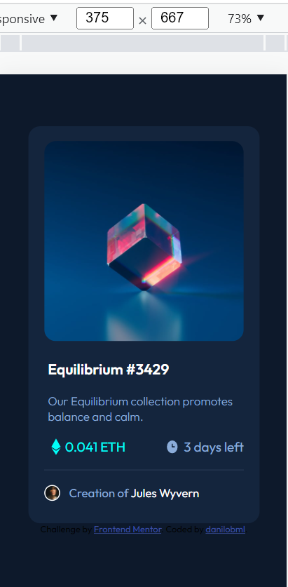

# Frontend Mentor - NFT preview card component solution

This is a solution to the [NFT preview card component challenge on Frontend Mentor](https://www.frontendmentor.io/challenges/nft-preview-card-component-SbdUL_w0U). Frontend Mentor challenges help you improve your coding skills by building realistic projects. 

## Table of contents

- [Overview](#overview)
  - [The challenge](#the-challenge)
  - [Screenshot](#screenshot)
  - [Links](#links)
- [My process](#my-process)
  - [Built with](#built-with)
  - [What I learned](#what-i-learned)
  - [Continued development](#continued-development)
  - [Useful resources](#useful-resources)
- [Author](#author)
- [Acknowledgments](#acknowledgments)

**Note: Delete this note and update the table of contents based on what sections you keep.**

## Overview

As a newbie, I am still finding positioning difficult and it took me a while to solve this, in the end I don't know if it's fully right. 

I'd really appreciate f you could take a look and give me feedbacks and tips, pointing out what's wrong and what could be done in a better/easier way. Thank you!

### The challenge

Users should be able to:

- View the optimal layout depending on their device's screen size
- See hover states for interactive elements

### Screenshot

### Links

- Solution URL: (https://github.com/danilobml/nft-preview)
- Live Site URL: (https://danilobml.github.io/nft-preview/)

## My process

### Built with

- Semantic HTML5 markup
- CSS custom properties
- Flexbox
- Mobile-first workflow

### What I learned

- Hover effects with images on the background.
- Better positioning technicques.

### Continued development

I need to practive css flex-box positioning. It still takes me a long time to finish even simple tasks.

### Useful resources

- [W3 Schools](https://www.w3schools.com/) 
- [Stack Overflow](https://stackoverflow.com/)

Both bring great resources. They helped me with hover effects and positioning. I consulted them a couple of times, and don't remember now which helped me with what problem... lol

## Author

- Website - [danilobml](https://github.com/danilobml)

## Acknowledgments

As always, I'd like to thank my great teacher Ben, at WBS Coding School Berlin.